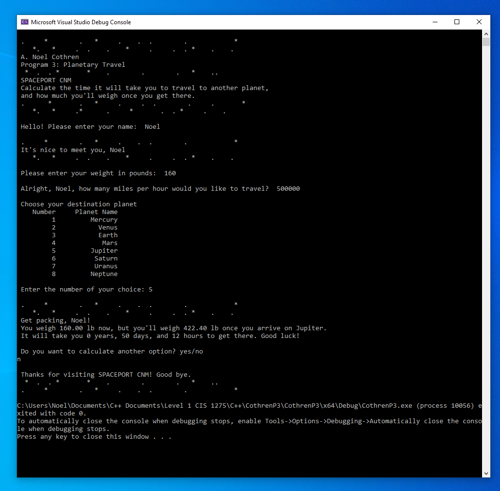

# Interplanetary Travel

This C++ console app takes the user on a hypothetical trip to space. It asks the user to input his/her destination planet, name, weight, and desired travel speed then calculates travel time and new weight on the destination planet. 

It was a CIS 1275 C++ Level 1 class project for [CNM](https://cnm.edu), written for practice for working with `vectors`, C++ functions, and the `iostream` library. 

